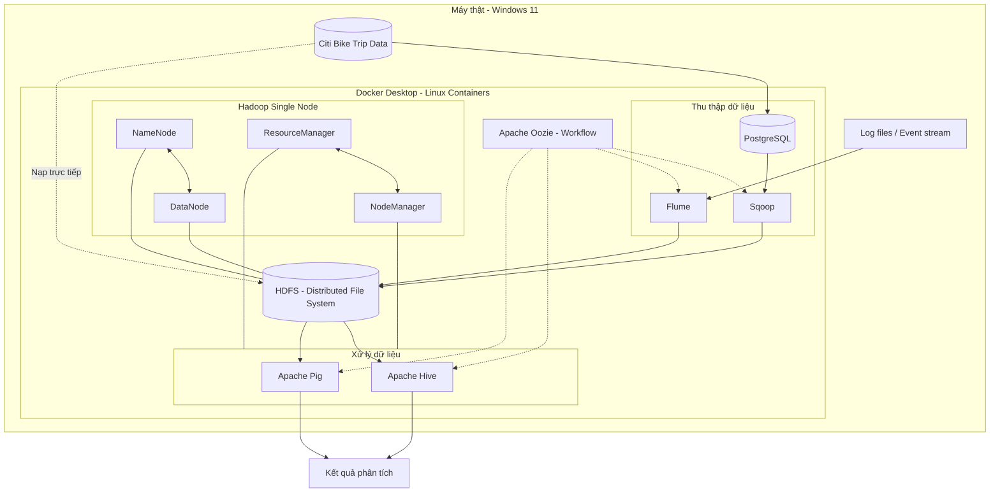

```mermaid
flowchart TB
    subgraph HOST["Máy thật - Windows 11"]
        subgraph DOCKER["Docker Desktop - Linux Containers"]
            subgraph HADOOP["Hadoop Single Node"]
                NN["NameNode"]
                DN["DataNode"]
                RM["ResourceManager"]
                NM["NodeManager"]

                NN <--> DN
                RM <--> NM
            end

            subgraph INGEST["Thu thập dữ liệu"]
                PG[("PostgreSQL")]
                SQ["Sqoop"]
                FL["Flume"]
            end

            HDFS[("HDFS - Distributed File System")]

            subgraph PROCESS["Xử lý dữ liệu"]
                HIVE["Apache Hive"]
                PIG["Apache Pig"]
            end

            OOZIE["Apache Oozie - Workflow"]

            PG --> SQ --> HDFS
            FL --> HDFS

            HDFS --> HIVE
            HDFS --> PIG

            OOZIE -.-> SQ
            OOZIE -.-> FL
            OOZIE -.-> HIVE
            OOZIE -.-> PIG

            NN --- HDFS
            DN --- HDFS
            RM --- PROCESS
            NM --- PROCESS
        end

        CSV[("Citi Bike Trip Data")]
        LOG["Log files / Event stream"]

        CSV --> PG
        CSV -.->|"Nạp trực tiếp"| HDFS
        LOG --> FL
    end

    HIVE --> RESULT["Kết quả phân tích"]
    PIG --> RESULT
```
